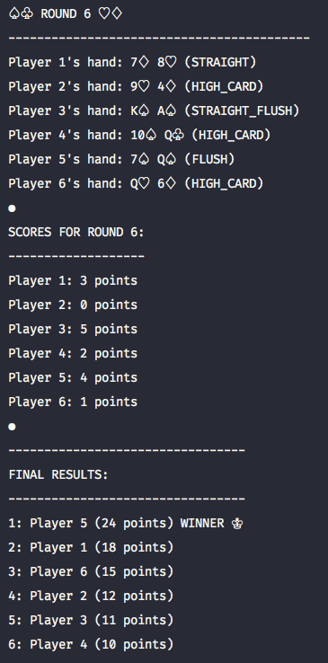

# Two Card Poker
A simple two card poker game in the terminal to help me revise Java.

* JDK Version 8
* Compile & run GameManager.java to start the game running in the terminal
* I have used some unicode characters to represent the different suits

**Example terminal output:**

